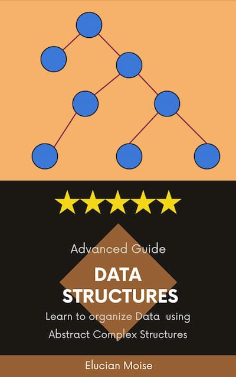

## ARA Project
 
**ARA** stands for *Advanced Research Article*. These articles are 100% generated using AI. We believe that AI is a cultural revolution. It is difficult to ask questions and combine generated content with meaningful pictures. We copy/paste the responses so you don't have to. Some people consider this work less valuable or unethical but not us. We know, generative AI becomes more, for every release. Soon people will realize the value of AI generated content is as good as the one created by experts.

import { Card, CardGrid } from '@astrojs/starlight/components';

## Contribution 

We are always looking for volunteers to contribute to our articles. You can do it if you are Sage-Code core team member, versed in AI prompt engineering. This website is created with Astro and StarLight free theme. Before you clone the GitHub repository, you should read the documentation about this technology:

* [Starlight doc](https://starlight.astro.build)
* [Astro doc](https://docs.astro.build/en/getting-started/)
* [Contribution Guide](/guides/contribution.md)

## Content

This content is organized in books. Select your book and study. Unlike a regular book these books are MD files, converted to static HTML using Astro. Authors of these books are Sage-Code mentors with GPL license. We try to keep our quality high, but if any information is not right, we apologies. These books are a testimonial for AI generators used. We do not claim any credit but you can't redistribute these books on your own commercial website. If you modify these books you must be also a contributor to the original. These books must remain free for everyone to use.

<CardGrid>
	<Card title="Website Generators" icon="open-book">
          	
	</Card>
	<Card title="Programming Book" icon="open-book">
          		
	</Card>
</CardGrid>
