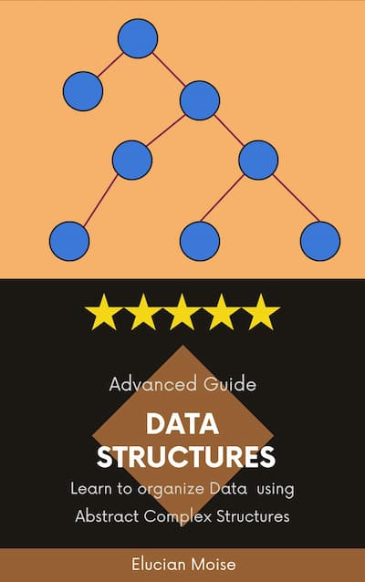
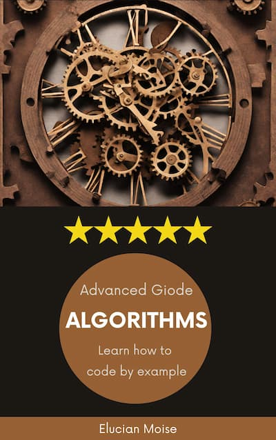

## Description
 
**ARA** stands for *Awesome Rust Algorithms*. These articles are 90% generated using AI. We believe that AI is a cultural revolution. We know, generative AI becomes more, for every release. Soon people will realize the value of AI generated content is as good as the one created by experts.

import { Card, CardGrid } from '@astrojs/starlight/components';

## Contribution 

We are always looking for volunteers to contribute to our research articles. You can do it if you are Sage-Code core team member, versed in AI prompt engineering. This website is created with Astro and StarLight free theme. Before you clone the GitHub repository, you should read the documentation about this technology:

* [Starlight doc](https://starlight.astro.build)
* [Astro doc](https://docs.astro.build/en/getting-started/)
* [Contribution Guide](/guides/contribution/)

## Content

This content is organized in books. Select your book and study. Unlike a regular book these books are MD files, converted to static HTML using Astro. Authors of these books is Gemini Pro (Bard AI) and published with GPL license. 

We try to keep our quality high, but if any information is not right, we apologies. These books are a testimonial for AI generators used. We do not claim any credit but you can't redistribute these books on your own for commercial purpose. If you modify these books you should also be a contributor. These books must remain free for everyone.

<CardGrid>
	<Card title="Data Structures" icon="open-book">
          		
	</Card>
  <Card title="Algorithms" icon="open-book">
          	
	</Card>
</CardGrid>

---

> Opportunity Is Missed By Most People Because It Is Dressed in Overalls and Looks Like Work - Thomas Edison
